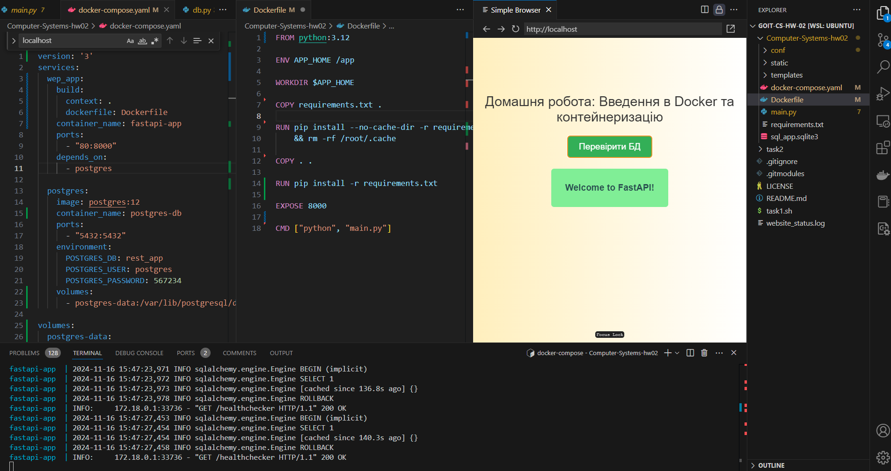

# goit-cs-hw-02
Тема 4. Введення в Docker та контейнеризацію

Перед початком роботи:
1. `git clone --recurse-submodules git@github.com:nickolas-z/goit-cs-hw-02.git`

## Завдання 1
Напишіть скрипт, який автоматично перевіряє, чи доступні певні вебсайти. Скрипт повинен використовувати команду `curl` для надсилання `HTTP GET` запитів до кожного сайту у списку та перевірки відповіді.

**Покрокова інструкція**
1. Список вебсайтів. У вашому скрипті має бути визначений масив з URL вебсайтів, які потрібно перевірити. Наприклад, https://google.com, https://facebook.com, https://twitter.com.
2. Перевірка доступності. Скрипт має перевіряти кожен сайт зі списку за допомогою curl, переконуючись, що сайт відповідає з `HTTP` статус-кодом `200`, що вказує на успішну доступність сайту.
3. Запис результатів у файл. Для кожного сайту результат перевірки (доступний чи недоступний) має бути записаний у файл логів. Назва файлу логів має бути визначена у скрипті.
4. Форматування виходу. Результати мають бути чітко сформульовані, наприклад: "[<https://google.com>](<https://google.com/>) is UP" або "[<https://twitter.com>](<https://twitter.com/>) is DOWN".
5. Вивід інформації. Після виконання скрипту має бути виведено повідомлення, що результати записано у файл логів із його назвою.

**Приклад виконання скрипту**
Скрипт виконує команди та виводить результати у файл website_status.log. Записи у файлі логів будуть відображати статус кожного сайту (UP або DOWN) на момент запуску скрипту.
```
<https://google.com> is UP
<https://facebook.com> is UP
<https://twitter.com> is UP
```
### Критерії прийняття
- Скрипт написано на `Bash`.
- Скрипт повинен опрацьовувати переадресацію.
- Використано цикл для обходу всіх сайтів у списку.
- Використано команду `curl` для перевірки HTTP-відповідей.
- Результати перевірки записані у файл логів, виведено про це повідомлення.
- Форматування коду чітке та акуратне.

### Запуск та перевірка
- Встановити `curl`
    - `sudo apt update`
    - `sudo apt install curl`
- Після створення файлу скрипта дозволяємо його запуск: `chmod +x task1.sh`
- Запуск скрипта: `./task1.sh`

### Ресурси
- [task1.sh](./task1.sh)
- [website_status.log](./website_status.log)

## Завдання 2
Клонуйте `FastAPI` застосунок, налаштуйте і запустіть його в `Docker` контейнері. Перевірте правильність роботи застосунку та підключення до бази даних.

**Покрокова інструкція**
1. Використовуючи команду `git clone`, клонуйте репозиторій за адресою https://github.com/GoIT-Python-Web/Computer-Systems-hw02. Перейдіть у клонований каталог.
2. Створіть `Dockerfile` із вказівками для створення образу `Docker` застосунку.
3. Напишіть `docker-compose.yaml` з конфігурацією для застосунку та `PostgreSQL`.
4. Використайте `Docker Compose` для побудови середовища, команду `docker-compose up` для запуску середовища.
5. Перевірте функціональність застосунку та доступність бази даних.

### Критерії прийняття
- Клоновано репозиторій, створено `Dockerfile` для створення образу `Docker` застосунку.
- Написано `docker-compose.yaml` з конфігурацією для застосунку та `PostgreSQL`.
- Використано `Docker Compose`, команду `docker-compose up` для побудови та запуску середовища.
- Застосунок є функціональним, а база даних — доступною, що підтверджується натисканням кнопки `Перевірити БД`.

### Запуск та перевірка
- `cd Computer-Systems-hw02`
- `docker-compose up --build`
- Заходимо в браузері на сторінку `localhost`
- В результаті маємо побачити наступну сторінку:



### Ресурси
- [Computer-Systems-hw02](https://github.com/nickolas-z/Computer-Systems-hw02)
- [Dockerfile](https://github.com/nickolas-z/Computer-Systems-hw02/blob/main/Dockerfile)
- [docker-compose.yaml](https://github.com/nickolas-z/Computer-Systems-hw02/blob/main/docker-compose.yaml)

## Додатково
- [Домашнє завдання до модуля "Основи операційних систем"](https://www.edu.goit.global/uk/learn/25315460/19336208/21190481/homework)
- [https://github.com/nickolas-z/goit-cs-hw-02](https://github.com/nickolas-z/goit-cs-hw-02)
- [goit-cs-hw-02-main.zip](https://s3.eu-north-1.amazonaws.com/lms.goit.files/c6c978f0-a718-45cc-b52f-4c250d3c3a3f%D0%94%D0%972_%D0%97%D1%83%D0%B1%D1%87%D0%B8%D0%BA%D0%9C%D0%B8%D0%BA%D0%BE%D0%BB%D0%B0%D0%9C%D0%B8%D0%BA%D0%BE%D0%BB%D0%B0%D0%B9%D0%BE%D0%B2%D0%B8%D1%87.zip)
- [Computer-Systems-and-Their-Fundamentals](https://github.com/nickolas-z/Computer-Systems-and-Their-Fundamentals)